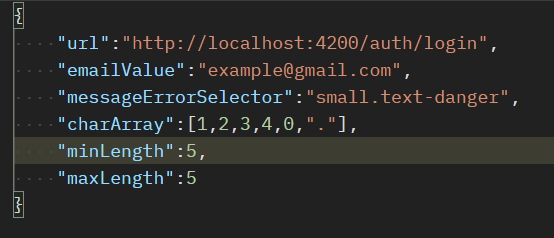
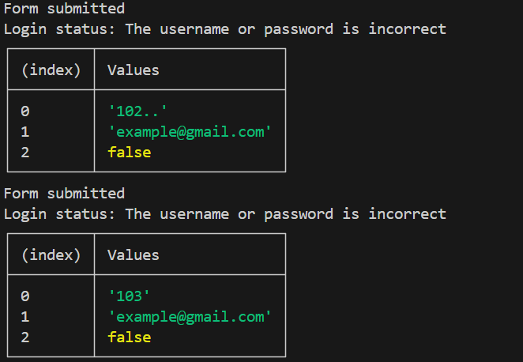
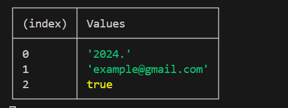
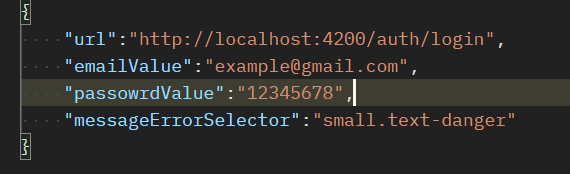

# Brutus


**Brutus** is a powerful bruteforce utility designed to automate the process of attempting to gain access to a system via brute force. It uses Puppeteer to simulate user interactions and attempts to login with different combinations of passwords.

## Author
This tool was developed by [Braimo  Selimane].

## Purpose
The purpose of this tool is to assist in penetration testing and security analysis. It can be used to identify weak passwords and potential vulnerabilities in a system's authentication process.

## Installation
To use this tool, you need to have Node.js and npm installed on your machine. Follow these steps to get started:

1. Clone the repository: `git clone https://github.com/ThuggerHacks/brutus.git`
2. Navigate to the project directory: `cd brutus`
3. Install the dependencies: `npm install`

## Usage
To run the **Brutus**, follow these steps:

1. Start the server: `npm start`
2. Send a POST request to the `/combine` endpoint with the following parameters:

    - `url`: The URL of the login page.
    - `emailValue`: The email address to use for login attempts.
    - `emailSelector`: The CSS selector for the email input field.
    - `passwordSelector`: The CSS selector for the password input field.
    - `buttonSelector`: The CSS selector for the login button.
    - `messageErrorSelector`: The CSS selector for the error message.
    - `charArray`: An array of characters to use for generating password combinations.
    - `minLength`: The minimum length of the password combinations.
    - `maxLength`: The maximum length of the password combinations.

3. The server will respond with either "Login successful" or "Login failed".

### API Endpoints

- `GET /test`: Returns a simple "Hello World" message.
- `POST /combine`: Attempts to login with different combinations of passwords.
- `POST /test`: Attempts to login with a specific email and password.

## Examples
To test it, just add the body as following



```Rememeber to change the values of the parameters with the actual values that you want to test.```

Now, Wait for the logs to complete



The last log on the console will be the user credentials, it will have 
the last index value as **true**



In the postman or whatever client you are making the request from, will have the following response if the credentials are found
-`Login Successful`

On the other hand, the /test rout is to test for credentials, here  the body will be like:



In this case, it doesn't run **combination**, instead, it runs once for that specific email and password.
If it fails, the server will send an error:
-`Login Error`

Otherwise, the server will send a success message:

 - `Login Successful`

Note that you can pass other parameters if you want to customize your selectors:

    - `emailSelector`: The CSS selector for the email input field.
    - `passwordSelector`: The CSS selector for the password input field.
    - `buttonSelector`: The CSS selector for the login button.


⚠️ Please note that this tool is intended for ethical use only. Always obtain proper authorization before conducting penetration testing.

Feel free to contribute with any ideas! 😁